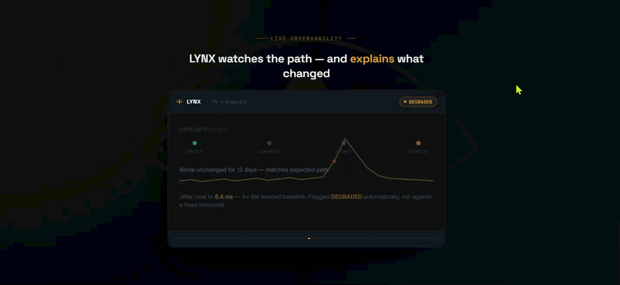
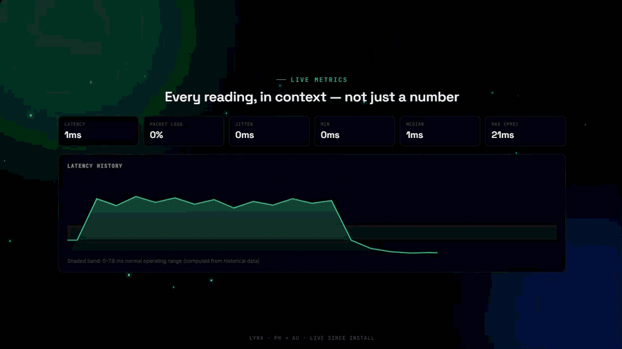

# LYNX

**See the path. Keep the evidence.**

LYNX is a self-hosted network monitoring application that turns latency, packet loss, jitter, and routing history into an operational record. It helps a team understand whether a configured network path is behaving as expected—and retain evidence when it is not.

[View the preview](#preview) · [Engineering notes](#engineering-notes) · [Project scope](#project-scope)

## Why it exists

A point-in-time speed test cannot explain an intermittent path problem. LYNX grew from the need to compare behavior over time, distinguish local symptoms from upstream ones, and support escalation with a record instead of a recollection.

## Preview

This is a visual product presentation, not live telemetry. The monitoring agent runs within an authorized network; no public monitoring endpoint is offered.

<strong>View the metrics and reporting presentation</strong>

## What the application does

- Continuously collect configured latency, reachability, loss, and jitter measurements.
- Store measurement history in SQLite with retention and rollup behavior.
- Evaluate NORMAL, DEGRADED, and CRITICAL status with consecutive-sample rules.
- Compare traceroute observations and retain route-change events.
- Watch configurable hop patterns and show local-versus-remote context.
- Maintain incident history and configurable alerts.
- Export CSV/JSON evidence and generate PDF reports.
- Separate observed network hops from an optional geographic illustration.

## Engineering notes

| Decision | Why it matters |
| --- | --- |
| Always-on agent independent of the browser | Monitoring continues when nobody has the dashboard open |
| One Node process and SQLite store | Collection and API access share a straightforward operational model |
| Configured thresholds retain priority | An adaptive baseline must not normalize persistently poor performance |
| Consecutive-sample status changes | A single noisy reading need not become an incident |
| Evidence separate from interpretation | A route change proves that the observed path changed, not why an ISP changed it |
| PDF generation without a browser engine | Reports do not require a headless browser on the monitoring machine |

**Application stack:** Node.js · TypeScript · Express · SQLite/better-sqlite3 · React · Vite · Tailwind CSS · Recharts · Windows Service · PDFKit

Remote dashboard access can use Cloudflare Pages, Tunnel, and an appropriate access gate; the collection agent remains on the monitoring host.

## Project scope

LYNX observes configured targets, not arbitrary networks. Circuit labels do not themselves force traffic through a chosen ISP; that requires routing or separate monitoring hosts. Geographic annotations do not replace traceroute evidence, and path observations alone do not establish a routing root cause.

The application's existing MIT license remains in its private source repository. This separate repository publishes showcase materials rather than a runnable application distribution; see [NOTICE.md](NOTICE.md) for those materials.

## More projects

[FloorLink — browser screen sharing](https://github.com/deadwayz/floorlink-showcase) · [HYLE — IT asset management](https://github.com/deadwayz/hyle-showcase) · [Creator's GitHub profile](https://github.com/deadwayz)
